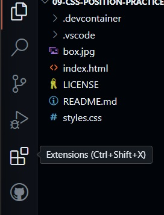
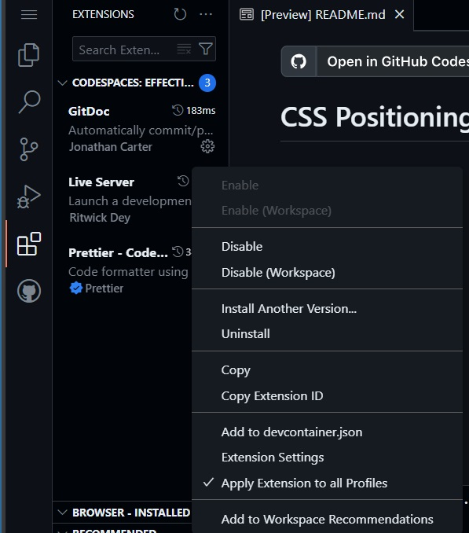
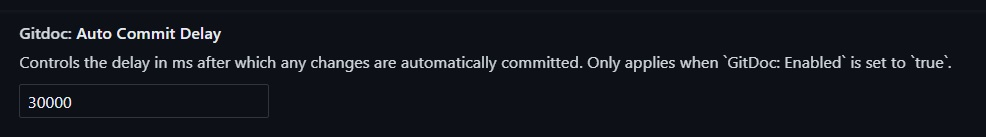
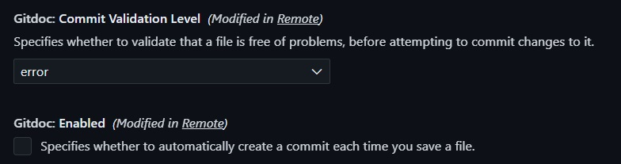

# CodespacesWebTemplate

Provides the basic configuration to launch a GitHub Codespace environment ready for HTML, CSS, and JavaScript coding. The project will spin up a Codespace with the following plugins:

- [Prettier](https://github.com/prettier/prettier-vscode)
- [LiveServer](https://github.com/ritwickdey/vscode-live-server)
- [GitDoc](https://github.com/lostintangent/gitdoc)

The **Prettier** plugin helps format your code to a consistent style. The **LiveServer** plugin will launch a local web server to host your web pages. The server will automatically refresh the page when you save your changes. the **GitDoc** plugin allows you to automatically commit and push your changes to your repository on a periodic basis. To enable the **GitDoc** plugin you will need to go to update the Settings configuration for it.

## Configuration

### GitDoc

GitDoc is a great extension to automatically commit and push changes into the repository. For developers who are just getting started with web development, configuring this extension to automatically save their changes can make the introduction into git version control a much less intimidating experience. Because the extension cannot be configured by default to automatically push the changes up to the repository, users will need to update the settings the first time they launch project in Codespaces.

1. On the right-hand side of the `Codespaces` editor, click on the `Extensions` icon.

 2. Once the `Extensions` sidebar expands, click on the gear icon in the `GitDoc` extension card and then select `Extension Settings` from the menu.

3. Update the `Auto Commit Delay` to the number of milliseconds you would like the plugin wait before checking for file changes. The number is in milliseconds, 1 second = 1000 milliseconds. I've found the 5000 is a good number to use.

 

4. (Optional) Change the `Commit Validation Level` to `none`. This will allow all changes, even those that might include code which has errors in it, to be saved.

 

5. Check the box associated with `Enabled` under the `Commit Validation Level` section.

6. Refresh the page in your browser so that the settings can be applied to the editor.
